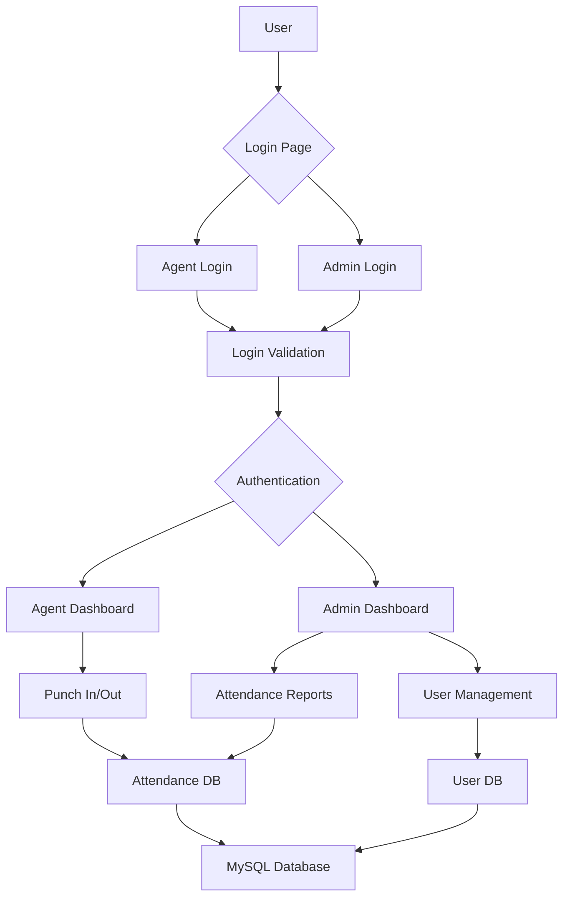

# Employee Punch-In/Punch-Out Web App - Architecture Plan

## System Overview

This web application allows employees (agents) to punch in and out of work, with separate interfaces for regular employees and administrators. The system uses HTML, CSS, and JavaScript for the frontend, with PHP for backend processing and MySQL for data storage.

## Database Design

### Users Table
```sql
CREATE TABLE users (
    id INT AUTO_INCREMENT PRIMARY KEY,
    username VARCHAR(50) UNIQUE NOT NULL,
    password VARCHAR(255) NOT NULL,
    role ENUM('agent', 'admin') NOT NULL,
    full_name VARCHAR(100),
    created_at TIMESTAMP DEFAULT CURRENT_TIMESTAMP
);
```

### Attendance Table
```sql
CREATE TABLE attendance (
    id INT AUTO_INCREMENT PRIMARY KEY,
    user_id INT NOT NULL,
    punch_in TIMESTAMP,
    punch_out TIMESTAMP NULL,
    FOREIGN KEY (user_id) REFERENCES users(id)
);
```

## File Structure
```
Attendence project/
├── css/
│   └── style.css
├── js/
│   └── main.js
├── includes/
│   ├── db.php
│   └── auth.php
├── agent-login.html
├── admin-login.html
├── agent-dashboard.html
├── admin-dashboard.html
├── login.php
├── punch.php
└── logout.php
```

## User Flow

### Agent Flow
1. Agent visits `agent-login.html`
2. Enters username and password
3. Submits to `login.php` which validates credentials
4. If valid, redirected to `agent-dashboard.html`
5. Agent can punch in or punch out
6. Actions processed by `punch.php`
7. Agent can logout via `logout.php`

### Admin Flow
1. Admin visits `admin-login.html`
2. Enters username and password
3. Submits to `login.php` which validates credentials
4. If valid, redirected to `admin-dashboard.html`
5. Admin can view attendance reports
6. Admin can manage users
7. Admin can logout via `logout.php`

## Security Considerations
- Passwords will be hashed using PHP's `password_hash()`
- Sessions will be used to maintain login state
- Input validation and sanitization for all user inputs
- Prepared statements for all database queries

## Technology Stack
- Frontend: HTML5, CSS3, JavaScript
- Backend: PHP 7+
- Database: MySQL via phpMyAdmin
- Server: XAMPP
## System Architecture Diagram



## Component Interactions

### Login Process
1. User accesses either agent-login.html or admin-login.html
2. User submits credentials to login.php
3. PHP script validates against database
4. Valid users are redirected to appropriate dashboard
5. Session is created to maintain login state

### Punch In/Out Process
1. Agent accesses agent-dashboard.html
2. Agent clicks "Punch In" or "Punch Out" button
3. Action sent to punch.php
4. PHP script updates attendance table in database
5. Updated status displayed to user

### Reporting Process
1. Admin accesses admin-dashboard.html
2. Admin can view various reports
3. Data retrieved from database via PHP scripts
4. Results displayed in formatted tables/charts